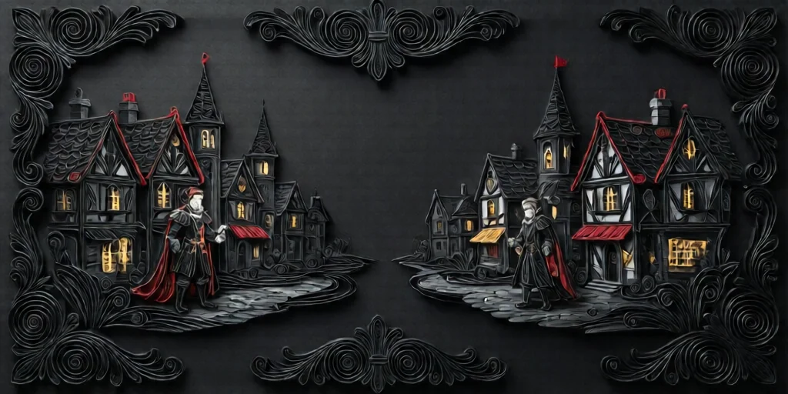
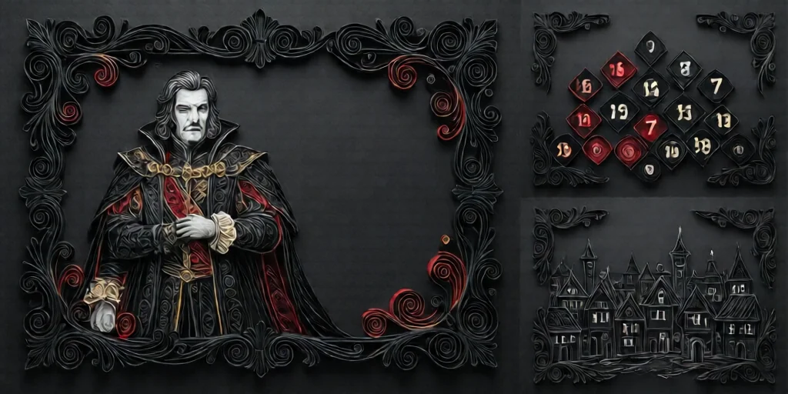
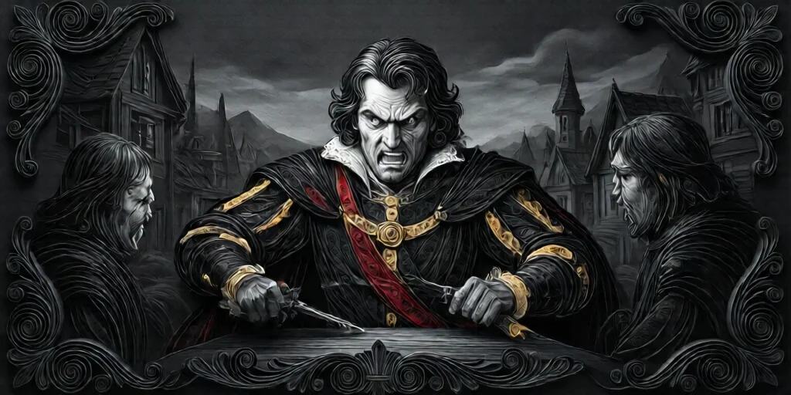
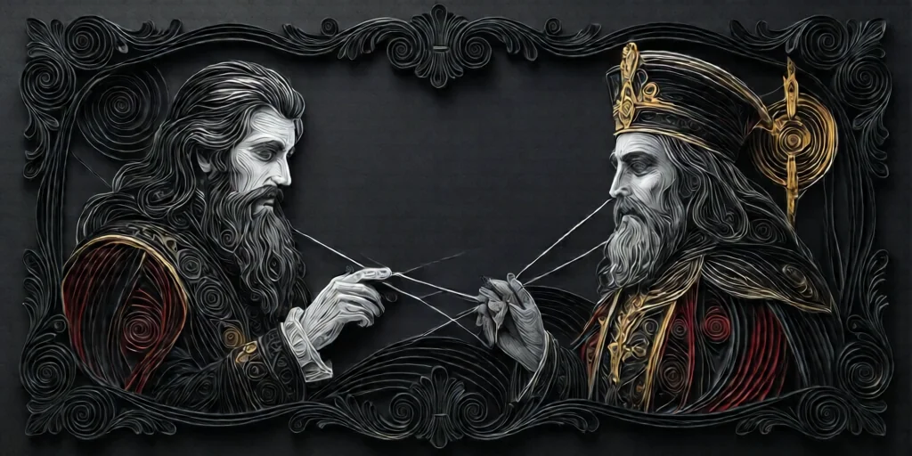
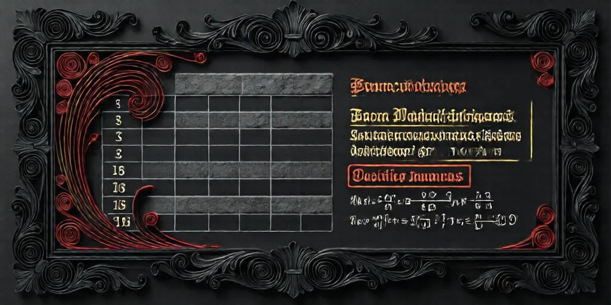

#  남작 (Baron)

**진영**:  미니언 (악 팀)

---

## 능력

> **"추가 아웃사이더가 게임에 존재한다. [+2 아웃사이더]"**

게임 시작 시  **아웃사이더 토큰 2개**가 추가되고,
대신  **마을 주민 토큰 2개**가 제거된다.

---

## 작동 방식

- 이야기꾼이 게임 **셋업 단계**에서 마을 주민 토큰 2개를 제거하고 아웃사이더 토큰 2개로 교체합니다.
- 추가되는 아웃사이더는 **항상 마을 주민을 대체**합니다 (다른 유형은 대체하지 않음).
- 이 변경은 **영구적**입니다 — 남작이 사망해도 아웃사이더 수는 원래대로 돌아가지 않습니다.
- 남작의 능력은 게임 시작 전에 이미 적용되므로, **밤 행동은 없습니다**.
-  주정뱅이가 추가되는 경우, 주정뱅이의 별도 셋업 규칙도 따릅니다.

---

## 셋업 예시

### 7인 게임

**남작 없을 때:**
| 마을 주민 | 아웃사이더 | 미니언 | 임프 |
|---|---|---|---|
| 5 | 0 | 1 | 1 |

**남작 있을 때:**
| 마을 주민 | 아웃사이더 | 미니언 | 임프 |
|---|---|---|---|
| 3 (-2) | 2 (+2) ✅ | 1 (남작) | 1 |

→ 이야기꾼이 마을 주민 토큰 2개를 빼고, 성자와 집사 토큰을 추가합니다.

### 15인 게임

**남작 없을 때:** 9/2/3/1
**남작 있을 때:** 7/4/3/1 ← 아웃사이더 +2 ✅

→ 기존 아웃사이더 2명에 더해, 수도사 토큰 대신 은둔자를, 그리고 주정뱅이를 추가합니다.

---

## 아웃사이더 증가 효과

아웃사이더가 늘어나면 선 팀이 약해집니다:

-  **집사**: 주인이 투표하지 않으면 투표 불가 — 투표권 제약
-  **주정뱅이**: 자신이 주정뱅이인지 모른 채 능력이 오작동
-  **은둔자**: 악 팀이나 임프로 등록될 수 있어 조사를 왜곡
-  **성자**: 처형당하면 **선 팀 즉시 패배** — 매우 위험

→ 마을 주민(정보 역할)이 줄고 아웃사이더가 늘어나, 선 팀의 정보력과 능력이 크게 약해집니다.

---

## 플레이 가이드 (악 팀)

### 핵심 전략

남작의 능력은 **게임 시작 전에 이미 완료**됩니다. 따라서 게임 중에는 오직 **임프의 생존**에 집중하세요.

1. **대담하게 플레이**: 능력이 이미 적용됐으므로 죽음을 두려워할 필요가 없습니다. 과감한 행동과 공격적인 지명으로 혼란을 만드세요.
2. **마을 주민 역할 사칭**: 이미 게임에 있는 마을 주민과 같은 역할을 주장하면, 진짜 마을 주민의 신뢰를 깎을 수 있습니다.
3. **아웃사이더 사칭**: 자신이 아웃사이더라고 주장하면, 실제 아웃사이더 수에 혼란을 일으킵니다.
4. **성자 처형 유도**:  성자가 있다면 처형하도록 유도하세요 — 선 팀 즉시 패배!
5. **일찍 처형당하기**: 일찍 죽으면 "무고한 사람"으로 신뢰를 얻어, 죽은 뒤에도 정보를 수집하고 임프를 도울 수 있습니다.
6. **바론이 없다고 위장**: 악 팀원 2명이 아웃사이더를 사칭하면, "남작이 없는데 아웃사이더가 많다"는 혼란을 줄 수 있습니다.
7. **진짜 아웃사이더에게 의심 전가**: 실제 아웃사이더를 공격해서 선 팀이 자기 팀원을 의심하게 만드세요.

### 주의할 점

- 아웃사이더 수가 예상보다 많으면 남작 존재가 드러날 수 있습니다.
-  사서가 아웃사이더를 확인하면 남작을 추론할 수 있습니다.
- 임프가 자결(Starpass)하면 남작이 새 임프가 될 수 있으므로, 후반을 대비하세요.

---

## 플레이 가이드 (선 팀)

### 남작 탐지 방법

1. **아웃사이더 수 세기**: 예상보다 아웃사이더가 많으면 남작이 있다는 뜻입니다.
2. **정보 역할 활용**:
   -  **사서**: 아웃사이더를 직접 확인
   -  **조사관**: 미니언을 조사하면 남작을 특정할 수 있음
   -  **까마귀 사육사**: 죽을 때 역할 확인
   -  **장의사**: 처형자 역할 확인
3. **다른 미니언 부재 확인**: 남작이 있으면  독살자,  스파이,  진홍의 여인이 적습니다 (미니언 슬롯을 남작이 차지하므로).

### 남작 대응 전략

1. **아웃사이더 보호**: 아웃사이더의 주장이 신뢰할 만하면 살려두세요 — 확인된 선 팀입니다.
2. **의심스러우면 빠르게 제거**: 남작이 있는지 불확실하면, 아웃사이더를 사칭하는 플레이어를 빠르게 처형하는 것도 방법입니다.
3. **주정뱅이 탐색**: 아웃사이더 수가 정확히 맞지 않으면  주정뱅이가 숨어있을 수 있습니다.
4. **처형 우선순위**: 남작 자체를 처형하는 것보다 **임프나 독살자**를 찾는 게 더 중요합니다. 남작의 능력은 이미 적용됐으므로 처형해도 효과가 되돌려지지 않습니다.

### 행동 패턴 읽기

- 남작은 죽음을 두려워하지 않아 **대담하고 공격적인 플레이**를 하는 경향이 있습니다.
- 이중 사칭, 조기 지명, 핵심 역할 도발 등의 행동을 주시하세요.
- 후반에 임프가 남작에게 임프 역할을 넘길 수 있으므로, 남작도 최종 후보에서 제외하지 마세요.

---

## 블러프 권장

남작은 다음 역할을 사칭하기 좋습니다:

-  **공감인**: 거짓 숫자로 선 팀의 추리를 방해
-  **요리사**: 악 쌍 수 정보로 신뢰 획득 후 오도
-  **장의사**: 처형 결과를 거짓으로 보고
-  **수도사**: "보호했는데 아무도 안 죽었다"로 위장
-  **집사** /  **은둔자**: 아웃사이더로 위장

---

## 상호작용

| 역할 | 상호작용 |
|---|---|
|  **사서** | 아웃사이더 수 증가를 통해 남작 존재를 추론 가능 |
|  **조사관** | 남작을 미니언으로 직접 탐지 가능 |
|  **주정뱅이** | 남작이 추가한 아웃사이더에 포함될 수 있음 (별도 셋업 규칙 적용) |
|  **성자** | 남작이 추가한 성자가 처형되면 선 팀 즉시 패배 |
|  **은둔자** | 조사 왜곡으로 남작 탐지를 방해 |
|  **임프** | 자결(Starpass) 시 남작이 새 임프로 승계 가능 |
|  **독살자** | 남작이 미니언 슬롯을 차지하므로 독살자가 없을 가능성 |
|  **진홍의 여인** | 같은 이유로 진홍의 여인이 없을 가능성 |

---

## 악 팀 협력

- **첫날 밤**: 임프와 다른 미니언을 서로 확인합니다.
- **아웃사이더 파악**: 누가 아웃사이더인지 추론해서 악용하세요.
- **블러프 조율**: 팀원과 역할 사칭을 겹치지 않게 조율하세요.
- **희생 플레이**: 남작은 능력이 이미 끝났으므로, 임프를 보호하기 위해 의도적으로 의심을 끌 수 있습니다.

---

## 인원표 — 남작 영향

| 인원 | 기본 구성 (마을/아웃/미니언/임프) | 남작 시 (마을/아웃/미니언/임프) |
|---|---|---|
| 5인 | 3/0/1/1 | 1/2/1/1 |
| 7인 | 5/0/1/1 | 3/2/1/1 |
| 8인 | 5/1/1/1 | 3/3/1/1 |
| 9인 | 5/2/1/1 | 3/4/1/1 ← 아웃사이더 최대(4종) |
| 10인 | 7/0/2/1 | 5/2/2/1 |
| 12인 | 7/2/2/1 | 5/4/2/1 ← 아웃사이더 최대 |
| 13인 | 9/0/3/1 | 7/2/3/1 |
| 15인 | 9/2/3/1 | 7/4/3/1 ← 아웃사이더 최대 |

> ⚠️ Trouble Brewing에는 아웃사이더가 4종(집사/주정뱅이/은둔자/성자)뿐이므로,
> 기본 아웃사이더가 3명 이상인 18-20인 게임에서는 남작을 사용할 수 없습니다.

---

→ [미니언 목록](minion.md) | [역할 분류](roles.md) | [규칙 메인](index.md)

