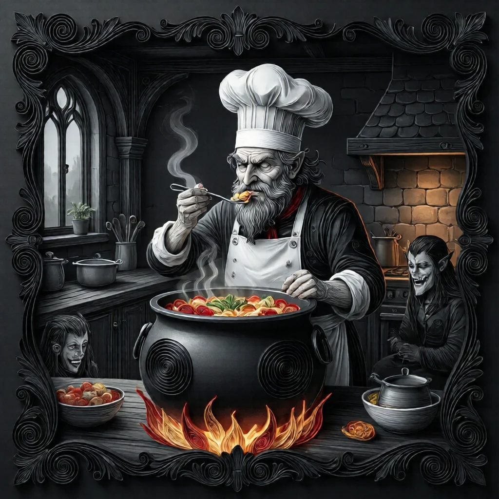
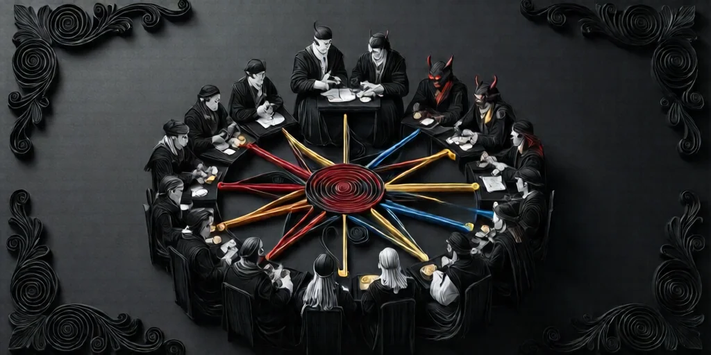
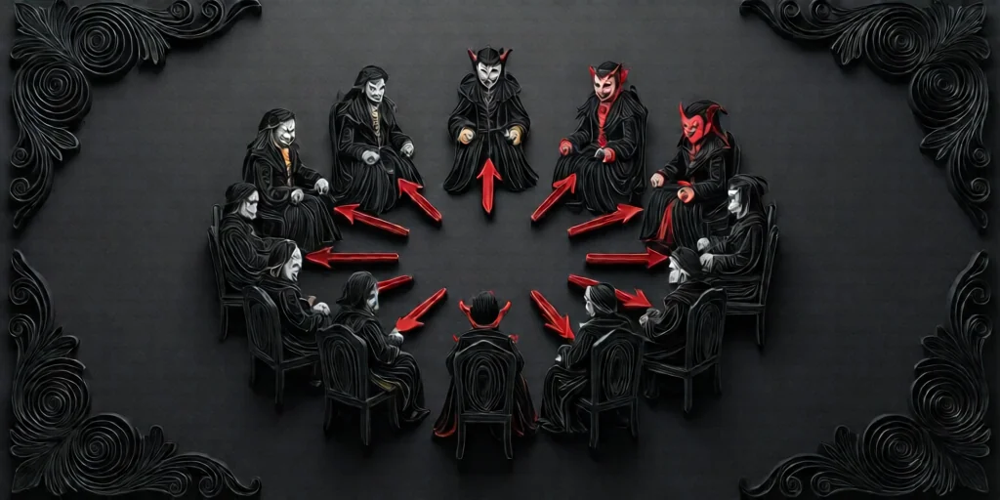
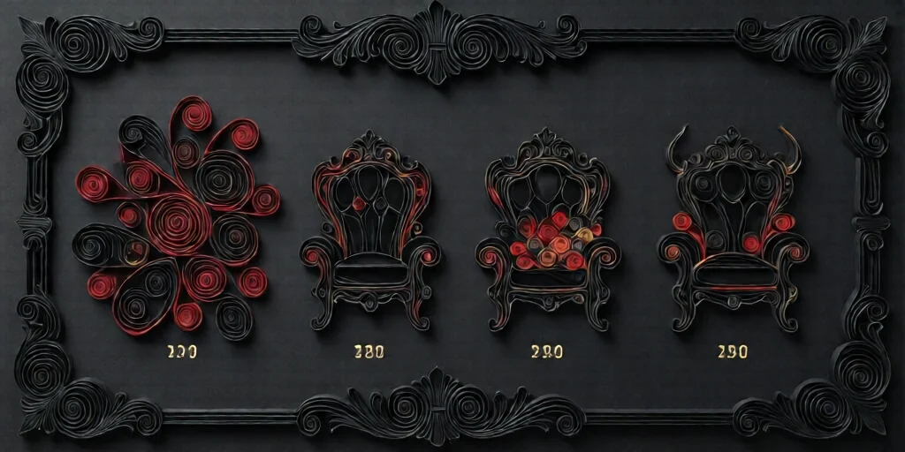
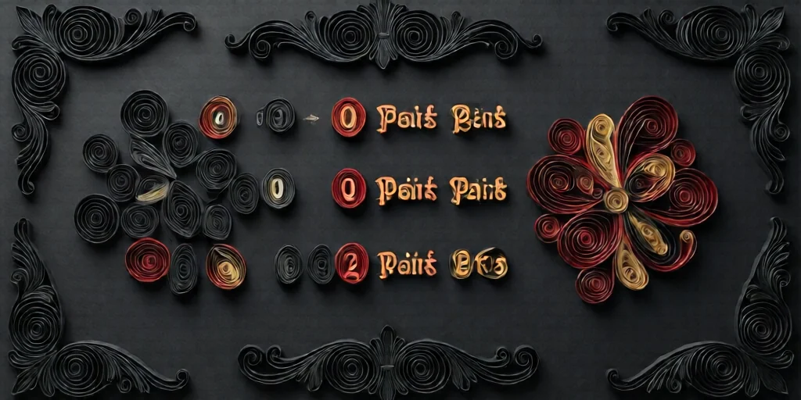

#  요리사 (Chef)



**진영**:  마을 주민 (선 팀)

---

## 능력



> **"게임 시작 시, 서로 이웃한 악 플레이어 쌍이 몇 개인지 안다."**

첫째 밤에 이야기꾼이 **이웃한 악 플레이어 쌍의 수**를 알려줍니다.
이 정보는 첫째 밤 한 번만 받으며, 이후에는 추가 정보가 없습니다.

---

## 작동 방식



### "이웃한 쌍"이란?
- 좌석 배치에서 **바로 옆에 앉은** 두 악 플레이어가 1쌍입니다.
- 한 플레이어가 **여러 쌍에 포함**될 수 있습니다 (예: 악-악-악 = 2쌍).
- 원형 좌석 배치이므로, 마지막 자리와 첫 번째 자리도 이웃입니다.
- 악 여행자(Traveller)가 요리사 행동 전에 합류했다면 포함됩니다.

### 이야기꾼 운영
- 첫째 밤, 요리사를 깨웁니다.
- 이웃한 악 쌍의 수만큼 **손가락**을 보여줍니다 (0이면 주먹).
- 요리사를 다시 재웁니다.

---

## 예시



### 예시 1: 0쌍
```
자리: [선]-[악]-[선]-[선]-[악]-[선]-[선]
```
악 플레이어 2명이 서로 떨어져 있음 → **0쌍**

### 예시 2: 1쌍
```
자리: [선]-[임프]-[남작]-[선]-[선]-[선]-[선]
```
임프와 남작이 나란히 앉아있음 → **1쌍**

### 예시 3: 2쌍
```
자리: [선]-[임프]-[남작]-[선]-[독살자]-[진홍의 여인]-[선]
```
임프-남작이 1쌍, 독살자-진홍의 여인이 1쌍 → **2쌍**

### 예시 4: 3쌍 (연속)
```
자리: [선]-[임프]-[독살자]-[남작]-[선]-[선]-[선]
```
임프-독살자 1쌍, 독살자-남작 1쌍 (독살자가 양쪽 쌍에 포함) → **2쌍**

### 예시 5: 은둔자/스파이 영향
```
자리: [임프]-[은둔자]-[독살자]
```
은둔자가 악으로 등록되면: 임프-은둔자 1쌍 + 은둔자-독살자 1쌍 = 2쌍
은둔자가 선으로 등록되면: 0쌍 (이야기꾼 재량)

---

## 이웃 쌍 해석 가이드



| 쌍 수 | 의미 | 추론 |
|---|---|---|
| **0** | 모든 악이 흩어져 있음 | 악 사이사이에 선이 끼어있음. 한 명을 찾으면 양옆은 선일 가능성 높음 |
| **1** | 악 2명이 나란히 앉음 | 한 구역에 악이 집중. 해당 구간을 좁혀나가세요 |
| **2** | 악 3명 연속 또는 2쌍 따로 | 대규모 게임에서 흔함. 다른 정보와 교차 확인 필요 |
| **3+** | 악 4명 이상 연속 | 매우 드묾. 은둔자나 스파이 영향 의심 |

---

## 플레이 가이드 (선 팀 — 요리사 본인)


### 핵심 전략

1. **좌석 배치 기억하기**: 누가 어디 앉았는지 반드시 메모하세요. 요리사의 정보는 좌석 위치와 직접 연결됩니다.
2. **다른 정보 역할과 교차 검증**:  공감인,  점쟁이의 정보와 합치면 악 팀 위치를 크게 좁힐 수 있습니다.
3. **후반 활용**: 생존자가 줄어들수록 요리사의 첫날 정보가 더 강력해집니다. 초반에는 범위가 넓지만 후반에는 결정적 단서가 됩니다.

### 결과별 전략

**0쌍인 경우:**
- 악 팀이 서로 붙어있지 않습니다. 낮에 서로 속삭이는 사람들을 주시하세요 — 떨어져 앉았지만 소통하려는 사람이 악일 수 있습니다.
- 한 명의 악을 찾으면, **그 양옆은 선 팀**일 가능성이 높습니다.

**1쌍 이상인 경우:**
- 악 팀이 어딘가에 모여 앉아있습니다. 동맹을 관찰하세요.
- 특정 구간의 플레이어들을 조사하면 악 그룹을 찾을 수 있습니다.

### 주의할 점

-  **스파이**가 선으로 등록되면 쌍 수가 실제보다 **줄어듭니다**.
-  **은둔자**가 악으로 등록되면 쌍 수가 **늘어납니다**.
- 스파이와 은둔자를 빨리 밝혀내면 요리사 정보의 정확도가 올라갑니다.

---

## 블러프 가이드 (악 팀이 요리사를 사칭할 때)


### 왜 요리사 사칭이 좋은가
- 첫째 밤에만 정보를 받으므로, 밤 행동이 계속 필요한 다른 역할보다 사칭하기 쉽습니다.
- 숫자 하나만 말하면 되므로, 초보 악 팀도 블러프하기 좋습니다.

### 사칭 전략

1. **0 또는 1이 무난**: 높은 숫자는 의심을 살 수 있습니다. 소규모 게임(5-7인)에서 2 이상은 비현실적입니다 (악이 2명뿐이므로 최대 1쌍).
2. **거짓 정보로 혼란**: 실제 0쌍인데 "1쌍"이라고 하면, 선 팀이 없는 악 그룹을 찾느라 시간을 낭비합니다.
3. **진짜 정보 활용**: 악 팀은 서로 어디 앉았는지 아므로, 실제 쌍 수를 알고 있습니다. 진짜 정보를 말해서 신뢰를 쌓은 뒤, 다른 방면에서 속이세요.
4. **은둔자 주의**: 은둔자 위치를 고려하지 않으면 숫자가 맞지 않아 들킬 수 있습니다.

---

## 상호작용


| 역할 | 상호작용 |
|---|---|
|  **스파이** | 선으로 등록되면 이웃 쌍 수 감소 (이야기꾼 재량) |
|  **은둔자** | 악으로 등록되면 이웃 쌍 수 증가 (이야기꾼 재량) |
|  **주정뱅이** | 요리사가 실제로 주정뱅이라면 잘못된 숫자를 받음 |
|  **독살자** | 첫째 밤에 중독되면 잘못된 숫자를 받음 |
|  **공감인** | 양옆 악 수 정보와 교차 확인 가능 — 매우 강력한 조합 |
|  **조사관** | 미니언 위치 정보와 조합하면 악 팀 좌석 특정 가능 |
|  **남작** | 남작 자체는 쌍 수에 영향 없음 (미니언이므로 악 팀으로 집계) |

---

## 자주 묻는 질문


**Q: 죽은 플레이어도 쌍에 포함되나요?**
A: 요리사의 능력은 첫째 밤에만 작동하므로, 그 시점에는 모두 살아있습니다.

**Q: 한 플레이어가 여러 쌍에 포함될 수 있나요?**
A: 네. 예를 들어 악-악-악 배치면 2쌍입니다 (가운데 악이 양쪽 쌍 모두에 포함).

**Q: 원형 배치에서 1번과 마지막 번호도 이웃인가요?**
A: 네. 좌석은 원형이므로 마지막 자리와 1번 자리도 이웃합니다.

**Q: 스파이/은둔자의 등록은 누가 결정하나요?**
A: 이야기꾼이 결정합니다. 게임 밸런스에 따라 스파이를 선으로 또는 은둔자를 악으로 등록할 수 있습니다.

---

→ [마을 주민 목록](townsfolk.md) | [역할 분류](roles.md) | [규칙 메인](index.md)

