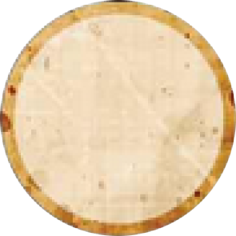

# 낮 진행

밤이 끝난 후 **밤 사망자 공개**로 낮이 시작됩니다.
낮은 토론 → 지목 → 투표 → 처형 순서로 진행됩니다.

---

## 토론

- 모든 플레이어가 **자유롭게** 정보·주장·의심을 발언할 수 있습니다.
- **비공개 대화**도 허용됩니다 (두 명이 잠시 자리를 피하는 방식 등).
- [사망한 플레이어](statuses.md)도 발언은 가능합니다.

---

## 지목 (Nomination)

- 처형 후보를 올리는 공식 선언입니다.
- **살아있는 플레이어**만 지목하거나 지목을 받을 수 있습니다.
- 당일 이미 **지목된 플레이어**는 재지목할 수 없습니다.
- 같은 날 **지목한 플레이어**는 다시 지목할 수 없습니다.
-  [처녀](townsfolk.md) 특수: 처음 지목한 자가 마을 주민이면 즉시 처형될 수 있습니다.

---

## 투표 (Vote)

 투표는 동시에 손을 드는 방식으로 진행합니다.

- 이야기꾼가 지목된 순서대로 **투표를 집계**합니다.
- **처형 문턱값** = 생존 인원의 과반수 (예: 7명 생존 → 4표 이상).
- 가장 많은 표를 받은 후보 **1명만** 처형 대상이 됩니다.
- 동률 시 **처형 없음**.
- [사망한 플레이어](statuses.md)도 **유령표 1회** 사용 가능합니다.
-  [집사](outsider.md)는 주인이 투표해야만 투표 가능합니다.

---

## 처형 (Execution)

 처형된 플레이어의 역할이 즉시 공개됩니다.

- 낮이 끝날 때 문턱값 이상의 최다 득표자 1명을 처형합니다.
-  [성인](outsider.md)이 처형되면 **선 팀 즉시 패배**합니다.
-  [임프(임프)](demon.md)가 처형되면 **선 팀 즉시 승리**합니다.
- 낮에 처형이 없을 수도 있습니다 (지목이 없거나 투표 미달).
-  [시장](townsfolk.md) 특수: 최종 3인 + 처형 없는 낮이면 선 팀 특수 승리 가능.

---

→ [밤 진행](night.md) | [주요 상태](statuses.md) | [처음으로](index.md)
