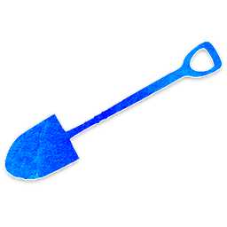
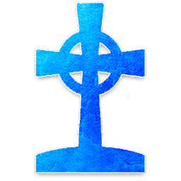

#  데몬 (Demon)

[악 팀](roles.md)의 우두머리. Trouble Brewing에는 **임프(Imp)** 단 1명입니다.
게임 내내 자신의 정체를 숨기며 매 밤 마을 주민을 제거합니다.

---

##  [임프 (Imp)](imp.md)

**능력**: 매 밤 1명을 선택해 죽인다.
자신을 선택하면 **살아있는 미니언 1명**이 새 임프가 된다.

### 임프 자살 전략
- 임프가 자신을 선택하면 죽고, 미니언이 대신 임프 역할을 얻습니다.
- 선 팀이 임프를 찾았다고 생각해도 다음 밤에 새 임프가 활동합니다.
-  스칼렛 우먼이 있으면 임프가 낮에 처형되어도 교체될 수 있습니다.

→ [임프 상세 가이드](imp.md)

---

## 임프를 노리는 선 팀 역할

-  [학살자](townsfolk.md) — 낮에 1회, 임프를 직격 사살 가능
-  [점술사](townsfolk.md) — 매 밤 2명 중 데몬 여부 확인
-  [장의사](townsfolk.md) — 처형된 플레이어 역할 확인으로 간접 추론
-  [수도사](townsfolk.md) — 임프 공격 대상을 보호

---

## 임프의 승리 조건

생존 플레이어가 **2명 이하**가 되면 악 팀 승리.
→ [낮 진행과 처형](day.md) | [밤 진행](night.md)

---

→ [미니언](minion.md) | [역할 분류](roles.md)
