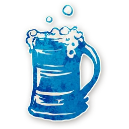
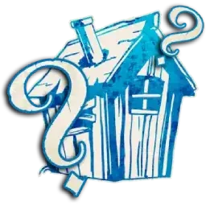
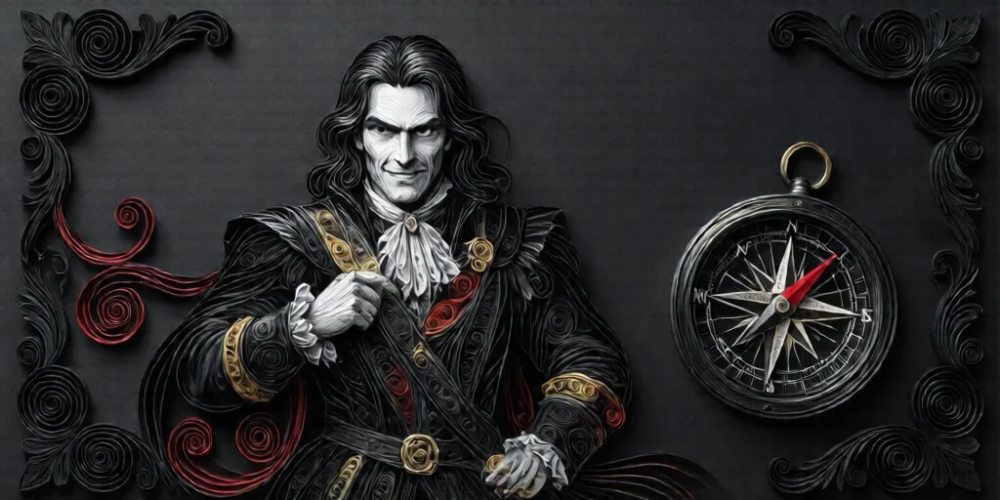
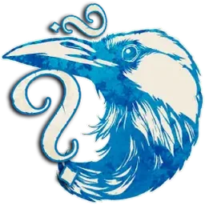
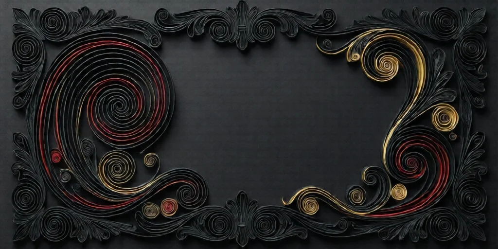
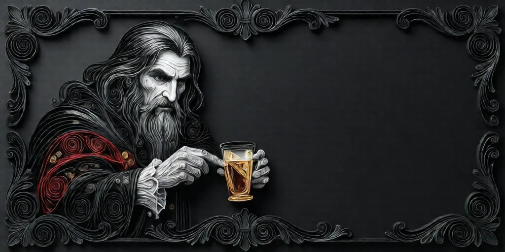
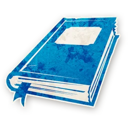
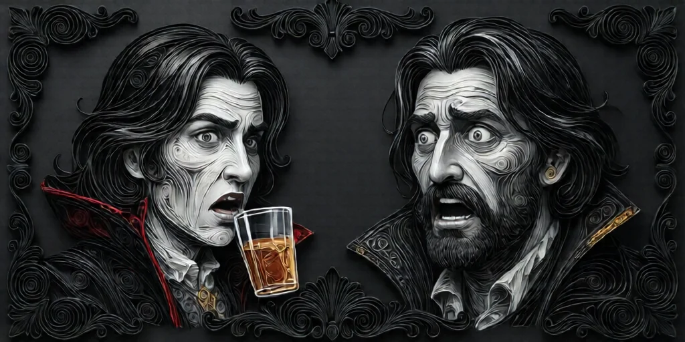

#  주정뱅이 (Drunk)

**진영**:  아웃사이더 (선 팀)

---

## 능력

당신은  **마을 주민**이라고 믿지만, 실제로는 **아웃사이더**이고 능력이 **오작동**한다.

---

## 플레이 가이드

### ⚠️ 중요: 당신은 자신이 술꾼이라는 것을 **모릅니다**

게임 중에는 자신이 Drunk인지 알 수 없습니다.
마을 주민 역할을 받았지만, 정보가 이상하다면 취했을 가능성을 의심하세요.

### 술꾼의 특징

- **거짓 역할**: 당신은  Townsfolk를 받았지만 **거짓**입니다.
- **오작동**: 당신의 능력은 **작동하지 않습니다**.
- **잘못된 정보**: 받는 정보가 모두 **틀릴 수 있습니다**.

### 의심해야 할 신호

- **정보 불일치**: 다른 플레이어와 정보가 맞지 않습니다.
- **능력 실패**: 능력이 발동 안 되는 것처럼 보입니다.
- **패턴 이상**: 여러 날 정보가 이상합니다.

### 당신이 술꾼이라면

1. **겸손하게**: "내 정보가 틀릴 수 있다"고 인정하세요.
2. **다른 정보 신뢰**: 다른 플레이어의 정보를 믿으세요.
3. **투표 참여**: 정보형이 아니라도 토론과 투표에 참여하세요.

---

## 특별 규칙

- **이야기꾼만 앎**: 누가 Drunk인지는 이야기꾼만 압니다.
- **플레이어는 모름**: 당신도 자신이 Drunk인지 **모릅니다**.
-  **사서**: 사서가 당신을 조사하면 **진짜 Townsfolk 역할**을 봅니다.
-  **장의사**: 당신이 처형되면 **진짜 Townsfolk 역할**이 공개됩니다.

---

## 게임 후 확인

게임이 끝나면 이야기꾼가 누가 Drunk였는지 공개합니다.

---

→ [아웃사이더 목록](outsider.md) | [역할 분류](roles.md) | [규칙 메인](index.md)

