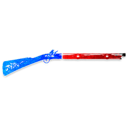

#  총잡이 (Gunslinger)

**분류**: 여행자 (Traveller)

---

## 능력

매일 **첫 번째 처형 투표가 집계된 직후**, 그 투표에 참여한 플레이어 1명을 골라 **죽게 할 수 있습니다**.

---

## 작동 방식

- 하루에 단 **한 번만** 기회가 있습니다.
- 반드시 그날 **첫 번째 처형 투표**가 끝난 뒤에만 사용할 수 있습니다.
- 총잡이가 쏘지 않기로 해도, 그날 기회는 소모됩니다.
- 대상은 방금 투표에 실제로 **손을 든 플레이어**여야 합니다.
- 이 죽음은 **처형이 아니라 일반 사망**입니다.

### 중요 포인트

- 총잡이 사망은 낮을 끝내지 않습니다.
- 장의사는 이 죽음을 보지 않습니다.
- 여행자 **추방 지지**는 능력의 영향을 받지 않으므로, 추방에 손든 사람은 총잡이 능력 대상으로 삼을 수 없습니다.

---

## 활용

- 중요한 투표를 밀어붙인 플레이어를 즉시 제거할 수 있습니다.
- 선 총잡이는 강하게 의심받는 축을 끊는 데 쓸 수 있습니다.
- 악 총잡이는 핵심 정보 역할이나 확정 선 플레이어를 낮에 제거할 수 있습니다.

---

## 상호작용

- **추방**: 추방은 처형 투표가 아니므로 총잡이 타이밍을 만들지 않습니다.
-  **장의사**: 총잡이가 죽인 플레이어는 처형되지 않았으므로 보지 않습니다.
-  **처녀**: 처녀 발동으로 낮이 즉시 끝나면, 그날 첫 처형 투표 자체가 없을 수 있습니다.

---

→ [여행자 규칙](travellers.md) | [낮 진행](day.md) | [규칙 메인](index.md)
