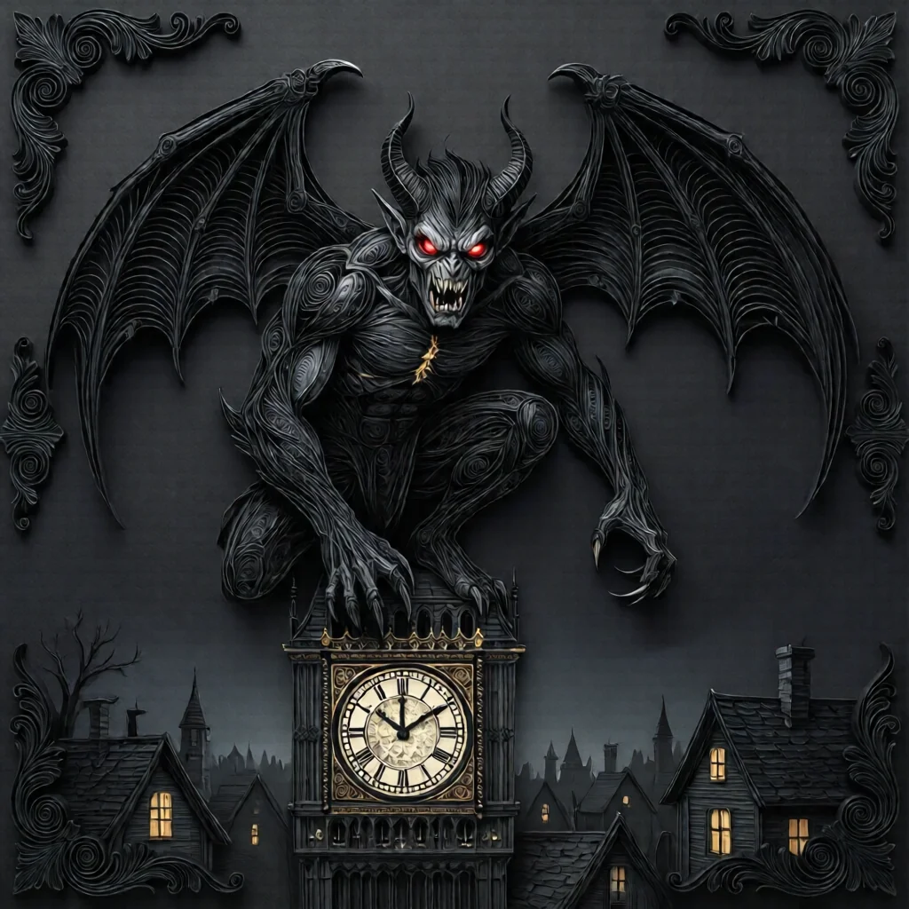
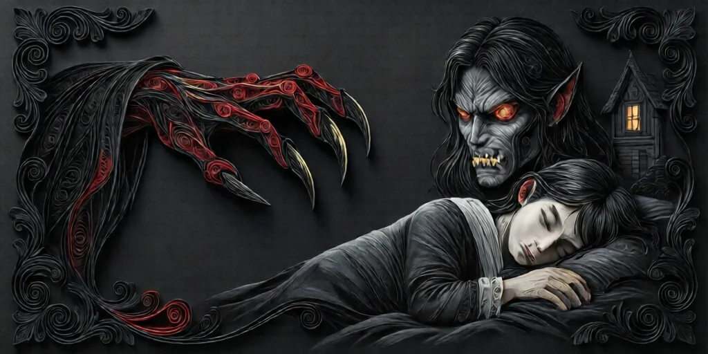
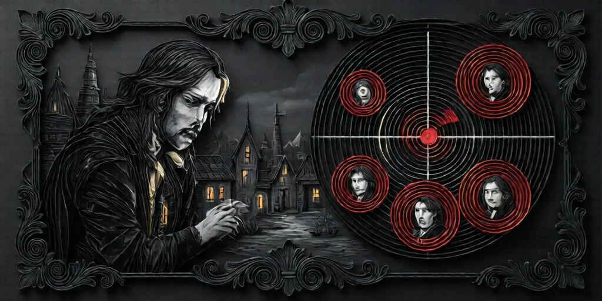
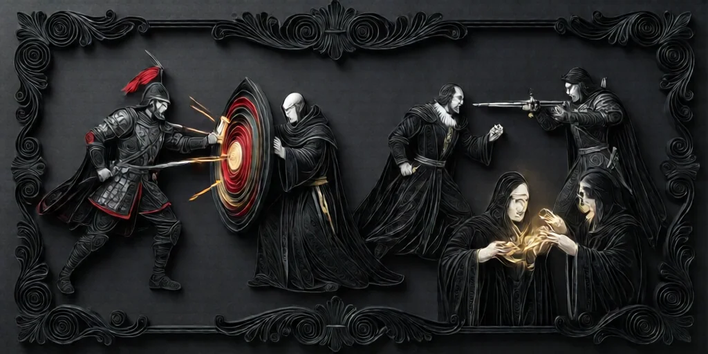
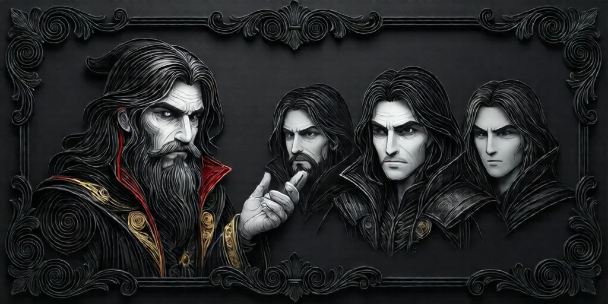
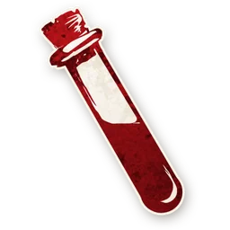
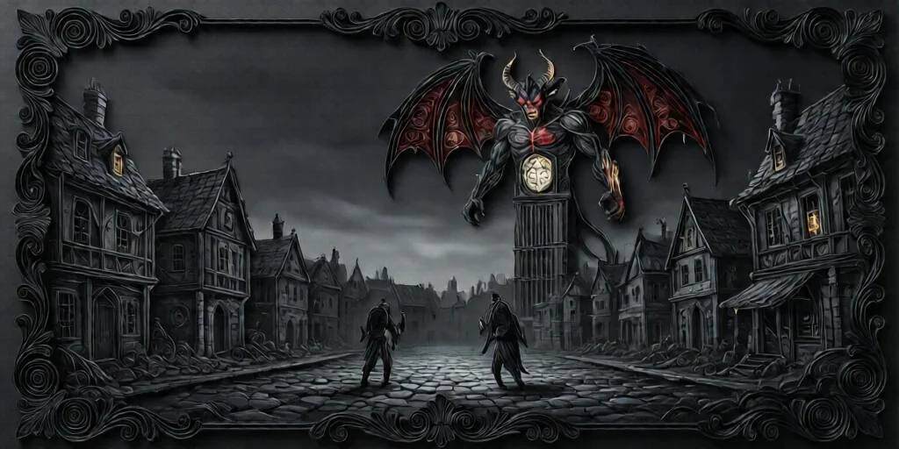

#  임프 (Imp)

**진영**:  임프 (악 팀)

---

## 능력

**매일 밤** (첫날 밤 제외) 1명을 죽인다.
**자신을 죽이면** 살아있는  미니언 1명이 **새 임프**가 된다.

---

## 플레이 가이드 (악 팀)

### 당신이 해야 할 일

- **매일 밤 공격**: 선 팀을 줄여 악 팀 승리로 이끄세요.
- **위협 제거**: 강력한 정보형 역할을 제거하세요.
- **의심 회피**: 선 팀을 사칭해 처형을 피하세요.

### 공격 대상 우선순위

1. **강력한 정보형**
   -  **점쟁이**: 당신을 찾을 수 있음
   -  **공감인**: 악 위치를 파악함
   -  **장의사**: 처형 결과로 악을 찾음

2. **위협적인 역할**
   -  **처단자**: 당신을 즉시 죽일 수 있음
   -  **처녀**: 능력 사용 전에 제거

3. **공격 불가**
   -  **군인**: 공격해도 안 죽음
   -  **수도사 보호 대상**: 보호받으면 안 죽음

### 자살 승계 (Star Pass)

**자신을 공격**하면:
- ✅ 당신은 즉시 죽음
- ✅ 살아있는 미니언 1명이 **새 임프**가 됨
- ✅ 게임은 계속됨 (선 팀 승리 아님!)
- ❌ 미니언이 모두 죽었다면 **선 팀 즉시 승리**

#### 자살 승계 전략

- **처형 직전**: 내일 처형될 것 같으면 자살해서 승계하세요.
- **의심 회피**: 새 임프로 게임을 리셋하세요.
- **최종 국면**: 미니언에게 승계해서 승리 기회를 주세요.

### 주의할 점

- **첫날 밤 없음**: 첫날 밤에는 공격하지 않습니다.
- **매일 밤 필수**: 두 번째 밤부터는 매일 공격해야 합니다.
- **자신 선택 가능**: 자신을 죽여 미니언에게 승계할 수 있습니다.
- **사망자 선택 가능**: 이미 죽은 사람도 선택할 수 있습니다 (블러프용).

### 전략 팁

1. **블러프**: 강력한 선 팀 역할을 사칭하세요.
2. **패턴 변경**: 매번 다른 유형의 역할을 공격하세요.
3. **미니언 보호**: 자살 승계를 위해 미니언을 살려두세요.
4. **정보 추적**: 누가 어떤 역할인지 추론해서 공격하세요.

---

## 블러프 권장

임프는 다음 역할을 사칭하기 좋습니다:

-  **공감인**: 거짓 정보로 선 팀을 혼란시킴
-  **점쟁이**: 거짓 임프 조사로 의심 전환
-  **장의사**: 처형 결과 거짓말
-  **수도사**: 보호 실패 변명 가능
-  **까마귀 사육사**: 밤에 안 죽으면 블러프 유지

### 블러프 주의사항

- **일관성 유지**: 블러프를 바꾸지 마세요.
- **정보 제공**: 거짓 정보를 주면서 신뢰를 얻으세요.
- **미니언 조율**: 다른 악 팀과 블러프를 조율하세요.

---

## 상호작용

-  **군인**: 공격해도 죽지 않습니다.
-  **수도사**: 보호받은 대상은 죽지 않습니다.
-  **시장**: 공격이 다른 사람에게 튕길 수 있습니다.
-  **처단자**: 당신을 즉시 죽일 수 있습니다.
-  **점쟁이**: 당신을 찾을 수 있습니다.
-  **진홍의 여인**: 당신이 죽으면 승계할 수 있습니다.

---

## 블러프 3개 (첫날 밤 정보)

첫날 밤, 임프는 미니언 정보와 함께 **이야기꾼이 선택한 선 캐릭터 3개**를 받습니다.

- 3개 모두 **현재 판에 없는** 타운스폴크 또는 아웃사이더
- 이야기꾼이 직접 고르며 임프는 선택할 수 없음
- 이 3개 중 하나인 척 **안전하게 블러핑** 가능 (해당 역할이 실제로 없음을 알기 때문)
-  **스파이**가 있으면 이야기꾼 재량으로 게임 내 역할도 거짓으로 줄 수 있음

---

## 악 팀 협력

- **첫날 밤**: 미니언들을 확인합니다.
- **정보 공유**: 미니언과 블러프를 조율하세요.
-  **독약꾼**: 어떤 역할을 중독할지 조율하세요.
-  **스파이**: 모든 역할 정보를 공유받으세요.
-  **진홍의 여인**: 5명 이상에서 죽으면 승계됩니다.
-  **남작**: 아웃사이더가 늘어나 선 팀이 약합니다.

---

## 승리 조건

악 팀은 다음 조건에서 승리합니다:

- **임프 생존**: 게임 종료까지 임프(당신)이 살아있음
- **선 팀 실패**: 선 팀이 임프를 찾지 못하거나 잘못 처형함
- **최종 국면**: 생존자가 줄어들어 악 팀이 유리해짐

---

→ [임프 목록](demon.md) | [역할 분류](roles.md) | [규칙 메인](index.md)

