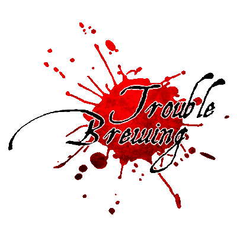

# Blood on the Clocktower 

**Trouble Brewing** 에디션 기준 규칙서입니다.

---

## 게임 목표

 **선 팀** — 데몬을 낮에 처형하면 승리합니다.
 **악 팀** — 마을 생존자가 2명 이하가 될 때까지 버티면 승리합니다.

---

## 목차

- [역할 분류](roles.md) — 마을 주민·아웃사이더·미니언·데몬
- [낮 진행](day.md) — 토론·지목·투표·처형
- [밤 진행](night.md) — 밤 순서·첫날 밤 특수 처리
- [주요 상태](statuses.md) — 생존·사망·중독·취함
- [앱 사용법](app.md) — 호스트·참가자 가이드

---

## 한눈에 보는 진행 흐름

1. 스크립트 확정 → 역할 무작위 배정
2. **첫날 밤** — 악 팀 서로 확인, 정보형 역할 첫 정보 수령
3. **낮** — 공개 토론 → [지목](day.md) → [투표](day.md) → [처형](day.md)
4. **밤** — 스크립트 밤 순서대로 각 역할 처리
5. 승리 조건 달성까지 낮/밤 반복

---

## 인원 구성표

| 인원 |  마을 주민 |  아웃사이더 |  미니언 |  데몬 |
|------|------|------|------|------|
| 5명  | 3 | 0 | 1 | 1 |
| 6명  | 3 | 1 | 1 | 1 |
| 7명  | 5 | 0 | 1 | 1 |
| 8명  | 5 | 1 | 1 | 1 |
| 9명  | 5 | 2 | 1 | 1 |
| 10명 | 7 | 0 | 2 | 1 |
| 11명 | 7 | 1 | 2 | 1 |
| 12명 | 7 | 2 | 2 | 1 |
| 13명 | 9 | 0 | 3 | 1 |
| 14명 | 9 | 1 | 3 | 1 |
| 15명 | 9 | 2 | 3 | 1 |

 **남작**이 있으면 아웃사이더 +2, 마을 주민 -2.
