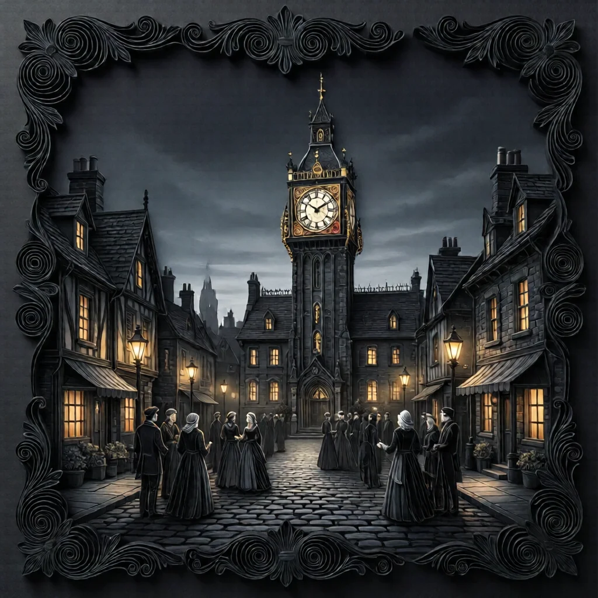
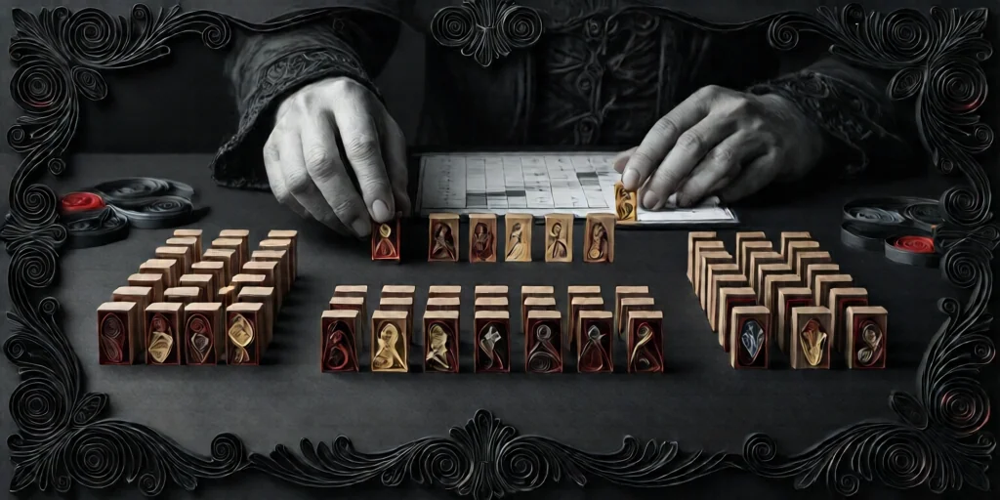
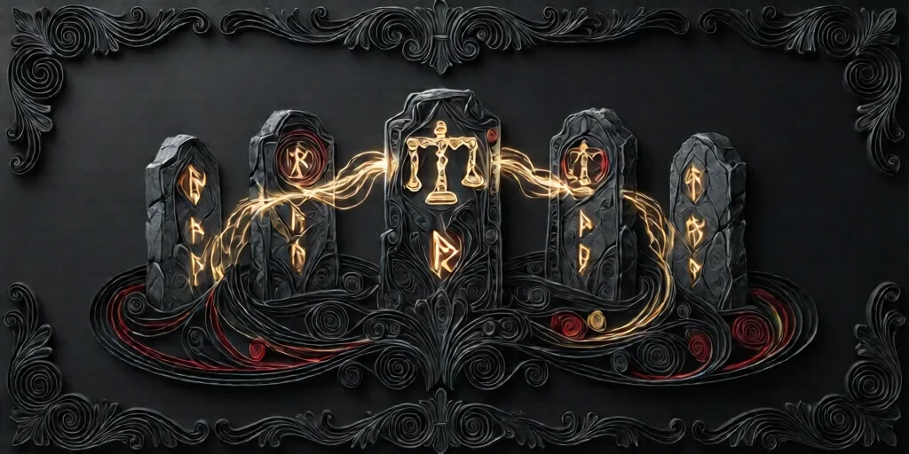

# Blood on the Clocktower 

**Trouble Brewing** 에디션 기준 규칙서입니다.

---

## 게임 목표

 **선 팀** — 임프를 낮에 처형하면 승리합니다.
 **악 팀** — 마을 생존자가 2명 이하가 될 때까지 버티면 승리합니다.

---

## 목차

- [역할 분류](roles.md) — 마을 주민·아웃사이더·미니언·임프
- [여행자 규칙](travellers.md) — 합류·이탈·추방·Trouble Brewing 여행자 5명
- [낮 진행](day.md) — 토론·지목·투표·처형
- [밤 진행](night.md) — 밤 순서·첫날 밤 특수 처리
- [주요 상태](statuses.md) — 생존·사망·중독·취함
- [앱 사용법](app.md) — 호스트·참가자 가이드

---

## 한눈에 보는 진행 흐름

### 셋업 (게임 시작 전)

1. 플레이어 수에 맞는 **역할 토큰**을 준비합니다 (아래 인원 구성표 참조).
2. 이야기꾼이 마을 주민, 아웃사이더, 미니언, 임프를 선택합니다.
3. 셋업 능력이 있는 역할을 먼저 처리합니다:
   -  **남작**: 마을 주민 -2, 아웃사이더 +2
   -  **주정뱅이**: 마을 주민 토큰 1개를 주정뱅이로 표시 (본인은 해당 마을 주민이라고 믿음)
4. 토큰을 섞어서 플레이어에게 **무작위로 배분**합니다.
5. 플레이어는 자신의 역할을 확인하고 **비밀로 유지**합니다.
6. 필요하다면 [여행자](travellers.md)는 게임 도중 합류하거나 중간에 이탈할 수 있습니다.

### 바로 가기

-  [여행자 규칙](travellers.md)
-  [희생양](scapegoat.md)
-  [총잡이](gunslinger.md)
-  [거지](beggar.md)
-  [관료](bureaucrat.md)
-  [도둑](thief.md)

### 게임 흐름

1. **첫째 밤** — 악 팀 서로 확인, 정보형 역할 첫 정보 수령
2. **낮** — 공개 토론 → [지목](day.md) → [투표](day.md) → [처형](day.md)
3. **밤** — 스크립트 밤 순서대로 각 역할 처리
4. 승리 조건 달성까지 **낮/밤 반복**

### 승리 조건

| 조건 | 승리 팀 |
|---|---|
| 임프가 처형됨 | **선 팀** 승리 |
| 생존자 2명 이하 | **악 팀** 승리 |
|  성자가 처형됨 | **악 팀** 승리 |
|  시장 + 생존자 3명 + 처형 없는 낮 | **선 팀** 승리 |

---

## 인원 구성표

| 인원 |  마을 주민 |  아웃사이더 |  미니언 |  임프 |
|------|------|------|------|------|
| 5명  | 3 | 0 | 1 | 1 |
| 6명  | 3 | 1 | 1 | 1 |
| 7명  | 5 | 0 | 1 | 1 |
| 8명  | 5 | 1 | 1 | 1 |
| 9명  | 5 | 2 | 1 | 1 |
| 10명 | 7 | 0 | 2 | 1 |
| 11명 | 7 | 1 | 2 | 1 |
| 12명 | 7 | 2 | 2 | 1 |
| 13명 | 9 | 0 | 3 | 1 |
| 14명 | 9 | 1 | 3 | 1 |
| 15명 | 9 | 2 | 3 | 1 |

 **남작**이 있으면 아웃사이더 +2, 마을 주민 -2.

### 남작 적용 시 인원 구성표

| 인원 |  마을 주민 |  아웃사이더 |  미니언 |  임프 |
|------|------|------|------|------|
| 5명  | 1 | 2 | 1 | 1 |
| 6명  | 1 | 3 | 1 | 1 |
| 7명  | 3 | 2 | 1 | 1 |
| 8명  | 3 | 3 | 1 | 1 |
| 9명  | 3 | 4 | 1 | 1 |
| 10명 | 5 | 2 | 2 | 1 |
| 11명 | 5 | 3 | 2 | 1 |
| 12명 | 5 | 4 | 2 | 1 |
| 13명 | 7 | 2 | 3 | 1 |
| 14명 | 7 | 3 | 3 | 1 |
| 15명 | 7 | 4 | 3 | 1 |

### 초보 추천 구성 (8인)

요리사, 공감인, 점쟁이, 장의사, 처녀, 주정뱅이(조사관으로 표시), 진홍의 여인, 임프
→ 정보가 풍부하고 상호작용이 많아 첫 게임에 적합합니다.

---

## 핵심 규칙 요약

### 능력 작동 원칙

- 능력은 사용 즉시 효과가 발생합니다 (보호 → 공격 순서도 즉시 적용).
- 능력 텍스트에 "선택한다"가 있으면 **플레이어가 선택**, 없으면 **이야기꾼이 결정**합니다.
- 플레이어는 **자기 능력의 결과만** 알 수 있습니다. 다른 플레이어의 능력 사용 여부, 성공/실패는 알 수 없습니다.

### 진영과 역할

- **진영(Alignment)**: 선 또는 악. 게임 중 변경될 수 있습니다.
- **역할(Character)**: 보유한 역할. 진영과 독립적으로 유지됩니다.
- 진영이 바뀌면 가장 이른 기회에 **비밀리에** 알려줍니다.

---

