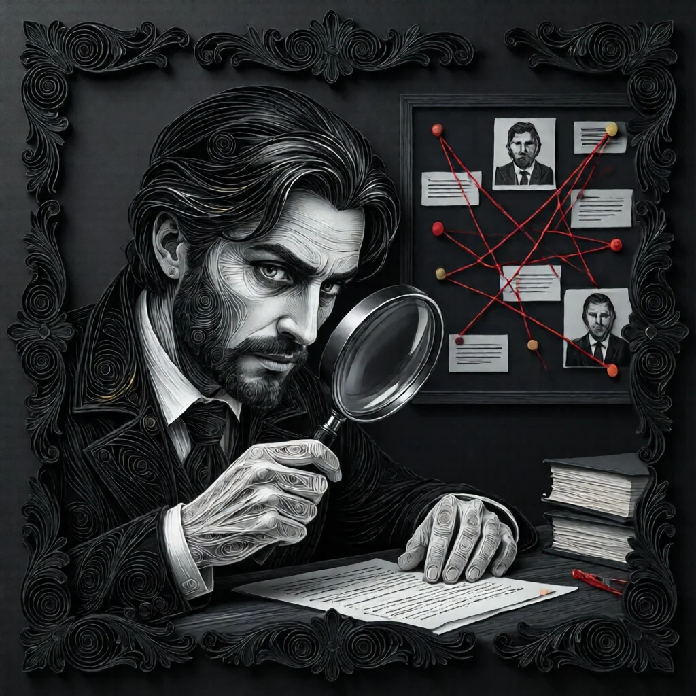

#  조사관 (Investigator)

**진영**:  마을 주민 (선 팀)

---

## 능력

**첫날 밤**, 두 플레이어를 제시받고, 그 중 한 명이 **특정 미니언**임을 안다.

---

## 플레이 가이드

### 당신이 해야 할 일

- **미니언 찾기**: 악 팀의 조력자를 식별하세요.
- **임프 추리**: 미니언을 통해 임프를 좁혀나가세요.
- **정보 공유**: 미니언 정보는 선 팀에게 매우 중요합니다.

### 주의할 점

-  **취함**: 당신이 취한 상태면 **잘못된 정보**를 받습니다.
-  **중독**: 중독되면 정보가 **오작동**할 수 있습니다.
-  **스파이**: 선으로 등록되어 조사에 안 걸립니다.
-  **은둔자**: 미니언으로 잘못 등록될 수 있습니다.

### 전략 팁

1. **빠른 정보 공유**: 미니언 정보는 게임 초반에 매우 강력합니다.
2. **교차 검증**:  요리사,  공감자 정보와 비교하세요.
3. **미니언 종류 추리**: 어떤 미니언인지에 따라 전략이 달라집니다.
   -  **독약꾼**: 매일 밤 누군가 중독됩니다.
   -  **스파이**: 그리모어를 보고 선으로 등록됩니다.
   -  **진홍의 여인**: 임프가 죽으면 승계할 수 있습니다.
   -  **남작**: 아웃사이더를 늘립니다.

---

## 상호작용

-  **스파이**: 선으로 등록되어 조사에서 빠집니다.
-  **은둔자**: 미니언으로 잘못 나타날 수 있습니다.
-  **주정뱅이**: 당신이 취했다면 정보가 틀립니다.

---

→ [마을 주민 목록](townsfolk.md) | [역할 분류](roles.md) | [규칙 메인](index.md)

