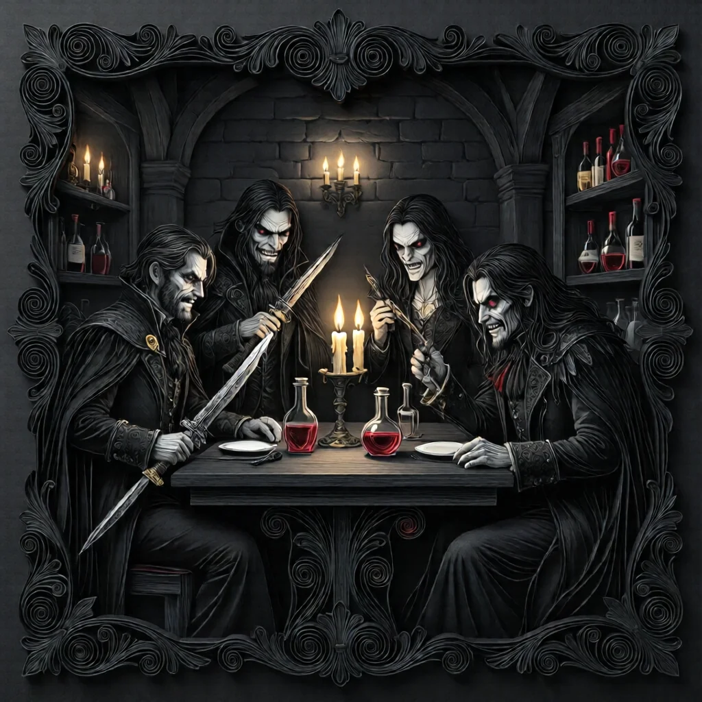
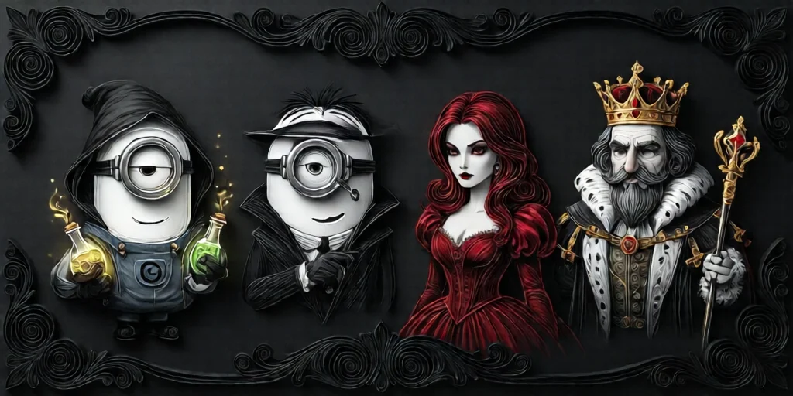
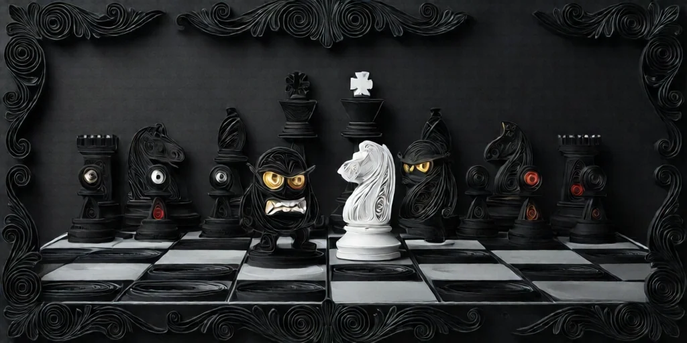

#  미니언 (Minion)

[악 팀](roles.md) 소속. 임프를 보좌하며 선 팀의 조사를 방해합니다.
미니언은 **첫날 밤에 서로와 임프를 확인**합니다. → [첫날 밤](night.md)

---

## 역할 목록

###  [독약꾼 (Poisoner)](poisoner.md)
매 밤 1명을 **중독** 처리.
중독된 플레이어는 그 밤 능력이 오작동한다.
→ [중독 상태](statuses.md)

###  [스파이 (Spy)](spy.md)
매 밤 **그리모어(역할 배정표)** 전체를 본다.
모든 플레이어의 역할·상태를 파악할 수 있다.
정보형 역할에게 [마을 주민](townsfolk.md) 또는 [아웃사이더](outsider.md)로 잡힐 수 있다.

###  [진홍의 여인 (Scarlet Woman)](scarletwoman.md)
**임프가 죽을 때** 생존 플레이어가 5명 이상이면, 스칼렛 우먼이 **새 임프**가 된다.
→ [임프 역할](demon.md)

###  [남작 (Baron)](baron.md)
게임 시작 시 **아웃사이더 +2** (마을 주민 -2).
→ [인원 구성](index.md)

---

## 전략적 역할

-  독살자는 핵심 정보형 역할의 정보를 오염시켜 선 팀을 혼란에 빠뜨립니다.
-  스파이는 완벽한 정보를 가지고 가장 위험한 선 팀원을 타깃으로 유도합니다.
-  스칼렛 우먼은 임프가 처형되어도 게임을 이어가는 보험 역할입니다.
-  바론은 게임 구성 자체를 바꿔 아웃사이더 비율을 높입니다.

→ [임프](demon.md) | [역할 분류](roles.md)

