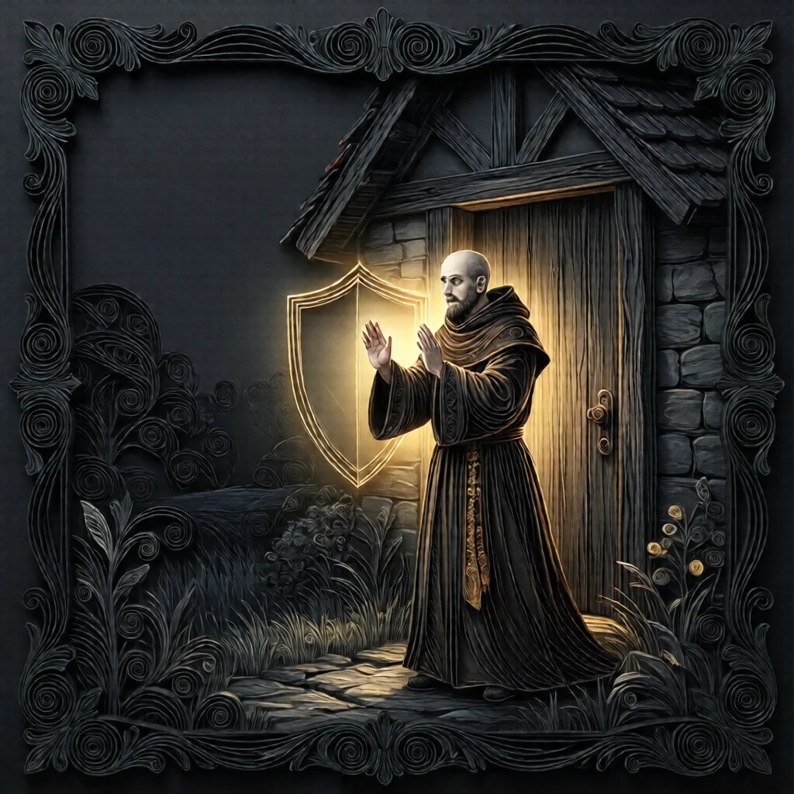
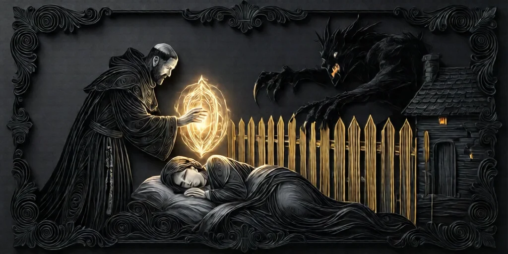
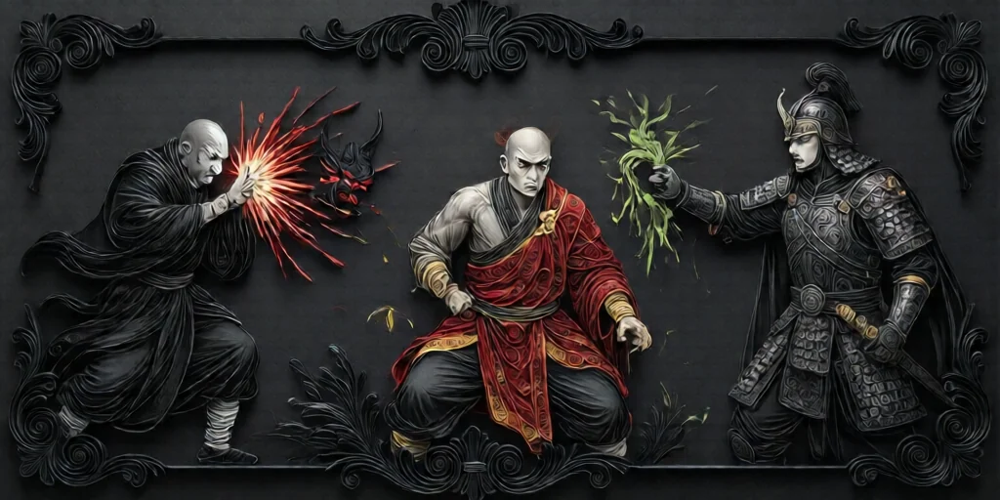

#  수도사 (Monk)

**진영**:  마을 주민 (선 팀)

---

## 능력

**매일 밤**, 자신 제외 1명을 보호해, 그 밤 **임프 공격**으로부터 지킨다.

---

## 플레이 가이드

### 당신이 해야 할 일

- **중요 인물 보호**: 정보형 역할이나 의심받지 않는 선 팀을 보호하세요.
- **예측**: 임프가 누구를 공격할지 예상하세요.
- **정보 활용**: 보호 성공 시 임프의 타겟을 알 수 있습니다.

### 보호 규칙

- **임프 공격만 막음**: 처형이나  학살자 능력은 막지 못합니다.
- **매일 밤**: 매일 밤마다 1명을 선택합니다.
- **자신 제외**: 자신은 보호할 수 없습니다.

### 주의할 점

-  **취함**: 당신이 취한 상태면 보호가 **실패**합니다.
-  **중독**: 중독되면 보호가 **실패**합니다.
-  **군인**: 이미 면역인 병사를 보호할 필요는 없습니다.
- **공격 여부 확인**: 아침에 사망자가 없다고 보호 성공은 아닙니다.

### 전략 팁

1. **핵심 역할 보호**:  점술사,  공감자 같은 강력한 역할을 보호하세요.
2. **블러프 방지**: 역할을 공개하지 마세요. 악 팀이 당신을 피할 수 있습니다.
3. **패턴 변경**: 매번 다른 사람을 보호해 예측을 어렵게 하세요.
4. **보호 성공 추론**: 누군가 계속 살아있다면 당신이 보호했거나 임프가 피한 것입니다.

---

## 상호작용

-  **임프**: 임프의 공격을 막습니다.
-  **군인**: 이미 면역이므로 보호 불필요.
-  **시장**: 공격이 튕겨도 보호 효과는 적용됩니다.

---

→ [마을 주민 목록](townsfolk.md) | [역할 분류](roles.md) | [규칙 메인](index.md)

