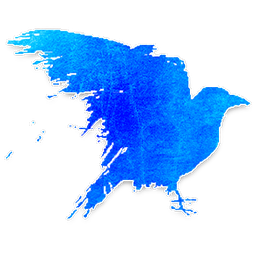

# 밤 진행

낮 처형이 끝나면 밤이 시작됩니다.
이야기꾼(호스트)가 **밤 순서**에 따라 각 역할을 처리합니다.

---

## 밤 기본 규칙

- 모든 플레이어는 **눈을 감고** 이야기꾼의 신호를 기다립니다.
- 해당 역할 플레이어가 신호 받으면 **손짓으로 대상을 선택**합니다.
- 이야기꾼가 정보를 **조용히 전달**합니다.
- **밤 사망자는 다음 날 아침에 공개**됩니다.
- [중독](statuses.md)·[취함](statuses.md) 상태면 정보가 오작동할 수 있습니다.

---

## 첫날 밤 순서

### 1. 미니언 정보
 [미니언](minion.md)들이 눈을 뜨고 서로와 임프를 확인합니다.

### 2. 임프 정보
 [임프](demon.md)가 미니언들을 확인합니다.
이야기꾼가 스크립트 내 미사용 선 역할 **3개를 블러프**용으로 제시합니다.

### 3. 정보형 역할 처리 (순서대로)
-  [독살자](minion.md) — 중독 대상 선택
-  [빨래꾼](townsfolk.md) — 마을 주민 포함 두 플레이어 + 역할 제시
-  [사서](townsfolk.md) — 아웃사이더 포함 두 플레이어 + 역할 제시
-  [탐정](townsfolk.md) — 미니언 포함 두 플레이어 + 역할 제시
-  [요리사](townsfolk.md) — 이웃한 악 쌍의 수 제시
-  [공감자](townsfolk.md) — 양옆 악 수 제시
-  [점술사](townsfolk.md) — 2명 선택 → 임프 여부 제시
-  [집사](outsider.md) — 주인 선택
-  [스파이](minion.md) — 그리모어 열람

---

## 반복 밤 순서

-  [독살자](minion.md) — 중독 대상 선택
-  [수도사](townsfolk.md) — 보호 대상 선택
-  [임프](demon.md) — 공격 대상 선택
-  [까마귀지기](townsfolk.md) — 밤에 죽은 경우 역할 확인
-  [장의사](townsfolk.md) — 전날 처형자 역할 확인
-  [공감자](townsfolk.md) — 양옆 악 수 제시
-  [점술사](townsfolk.md) — 2명 선택 → 임프 여부 제시
-  [집사](outsider.md) — 주인 선택
-  [스파이](minion.md) — 그리모어 열람

---

→ [낮 진행](day.md) | [역할 분류](roles.md) | [처음으로](index.md)
