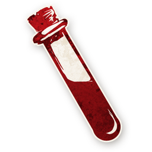

# 밤 진행

낮 처형이 끝나면 밤이 시작됩니다.
이야기꾼(호스트)이 **밤 순서**에 따라 각 역할을 처리합니다.

---

## 밤 기본 규칙

- 모든 플레이어는 **눈을 감고** 이야기꾼의 신호를 기다립니다.
- 해당 역할 플레이어가 신호 받으면 **손짓으로 대상을 선택**합니다.
- 이야기꾼이 정보를 **조용히 전달**합니다 (손가락 숫자, 고개 끄덕임 등).
- **밤 사망자는 다음 날 아침에 공개**됩니다 (밤 동안 누가 죽었는지 알 수 없음).
- [중독](statuses.md)·[취함](statuses.md) 상태인 플레이어도 정상적으로 깨워서 행동시키지만, **정보가 오작동**할 수 있습니다.

### 능력 작동 원칙

- 능력은 **사용 즉시 효과**가 발생합니다.
- 예: 수도사가 공감인을 보호 → 임프가 공감인을 공격 → 보호가 먼저 적용되어 공감인 생존.
- 죽은 플레이어의 능력은 즉시 **비활성화**됩니다 ("사망 시" 능력 제외).
- 중독/취함 상태의 플레이어는 능력이 **없는 것과 같습니다** — 하지만 이야기꾼은 정상적으로 깨워서 거짓 정보를 줄 수 있습니다.

---

## 첫째 밤 순서

첫째 밤은 게임의 기초 정보가 확립되는 중요한 밤입니다.

### 1. 미니언 정보
 [미니언](minion.md)들이 눈을 뜨고 **서로와 임프**를 확인합니다.
→ 미니언끼리 서로 누구인지, 임프가 누구인지 알게 됩니다.

### 2. 임프 정보
 [임프](demon.md)가 **미니언들**을 확인합니다.
이야기꾼이 스크립트 내 미사용 선 역할 **3개를 블러프**용으로 제시합니다.
→ 임프는 이 3개 역할을 자신의 역할로 사칭할 수 있습니다 (게임에 없는 역할이므로 누구도 반박 불가).

### 3. 정보형·행동형 역할 처리 (순서대로)

| 순서 | 역할 | 행동 |
|---|---|---|
| 1 |  [독살자](minion.md) | 중독 대상 선택 |
| 2 |  [세탁부](townsfolk.md) | 마을 주민 포함 두 플레이어 + 역할 제시 |
| 3 |  [사서](townsfolk.md) | 아웃사이더 포함 두 플레이어 + 역할 제시 |
| 4 |  [조사관](townsfolk.md) | 미니언 포함 두 플레이어 + 역할 제시 |
| 5 |  [요리사](townsfolk.md) | 이웃한 악 쌍의 수 제시 |
| 6 |  [공감인](townsfolk.md) | 양옆 악 수 제시 |
| 7 |  [점쟁이](townsfolk.md) | 2명 선택 → 임프 여부 제시 |
| 8 |  [집사](outsider.md) | 주인 선택 |
| 9 |  [스파이](minion.md) | 그리모어 열람 |

---

## 반복 밤 순서

둘째 밤부터는 다음 순서로 진행됩니다.

| 순서 | 역할 | 행동 |
|---|---|---|
| 1 |  [독살자](minion.md) | 중독 대상 선택 (이전 밤 중독은 해제) |
| 2 |  [수도사](townsfolk.md) | 보호 대상 선택 (자신 제외) |
| 3 |  [임프](demon.md) | 공격 대상 선택 |
| 4 |  [까마귀 사육사](townsfolk.md) | 이번 밤 사망 시 → 1명의 역할 확인 |
| 5 |  [장의사](townsfolk.md) | 전날 처형자의 역할 확인 |
| 6 |  [공감인](townsfolk.md) | 양옆 악 수 제시 |
| 7 |  [점쟁이](townsfolk.md) | 2명 선택 → 임프 여부 제시 |
| 8 |  [집사](outsider.md) | 주인 선택 (매 밤 변경 가능) |
| 9 |  [스파이](minion.md) | 그리모어 열람 |

---

## 밤 처리 특수 규칙

### 임프 공격

| 상황 | 결과 |
|---|---|
| 일반 공격 | 대상 사망 (다음 아침 공개) |
|  수도사 보호 대상 | 공격 무효 — 대상 생존 |
|  군인 공격 | 공격 무효 — 군인 면역 |
|  시장 공격 | 다른 플레이어에게 튕김 (이야기꾼 재량) |
| **임프 자결** | 임프 사망 →  진홍의 여인 승계 (5명 이상) 또는 미니언 중 랜덤 승계 |

### 독살자 중독

- 독살자가 선택한 플레이어는 그 밤과 다음 낮까지 **중독** 상태입니다.
- 중독된 플레이어의 능력은 **오작동**합니다 (거짓 정보를 받을 수 있음).
- 다음 밤에 독살자가 다른 대상을 선택하면 이전 중독은 **자동 해제**됩니다.

### 밤에만 작동하는 역할

- **까마귀 사육사**: 이번 밤에 사망한 경우에만 작동 (이전 밤 사망 시 작동 불가).
- **장의사**: 전날 처형이 있었을 때만 정보를 받습니다 (처형 없으면 스킵).

---

## 밤 진행 요약

```
모든 플레이어 눈 감기
  ↓
이야기꾼이 순서대로 각 역할을 깨움
  ↓
역할별 행동 처리 (선택 / 정보 전달)
  ↓
모든 역할 처리 완료
  ↓
"아침입니다. 눈을 뜨세요."
  ↓
밤 사망자 공개 → 낮 시작
```

---

→ [낮 진행](day.md) | [역할 분류](roles.md) | [처음으로](index.md)

