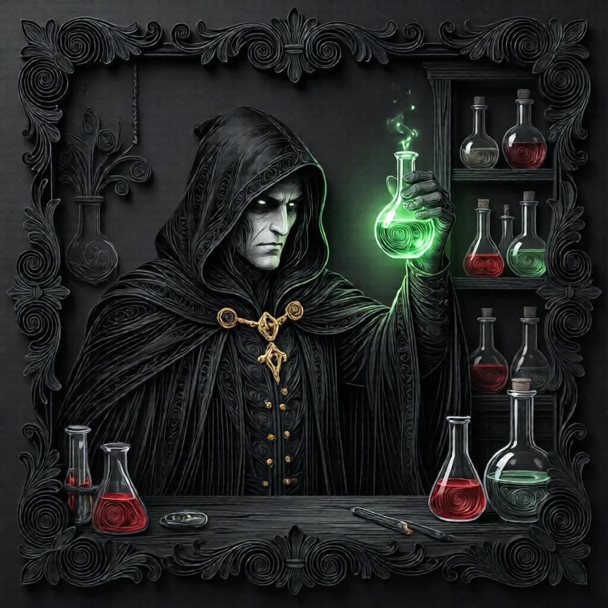
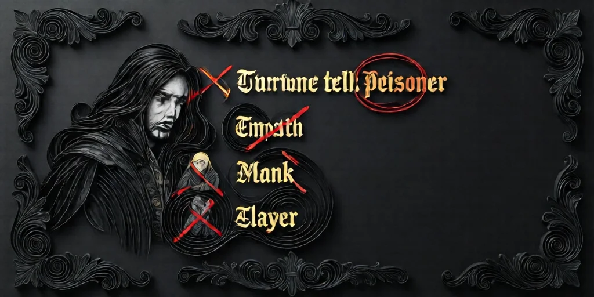

#  독약꾼 (Poisoner)

**진영**:  미니언 (악 팀)

---

## 능력

**매일 밤** 1명을 선택해 **중독**시킨다.
중독된 플레이어의 능력은 그날 밤과 다음 날 **오작동**한다.

---

## 플레이 가이드 (악 팀)

### 당신이 해야 할 일

- **정보 차단**: 강력한 정보형 역할을 중독시키세요.
- **혼란 유발**: 중독으로 선 팀의 정보를 틀리게 만드세요.
- **임프 보조**:  임프를 도와 선 팀을 혼란시키세요.

### 중독 대상 우선순위

1. **강력한 정보형**
   -  점술사: 임프 찾기를 막음
   -  공감자: 악 위치 정보를 막음
   -  장의사: 처형 조사를 막음

2. **위협적인 역할**
   -  학살자: 임프 킬을 막음
   -  수도사: 임프 공격 보호를 막음

3. **혼란 유발**
   -  빨래꾼: 틀린 정보 제공
   -  탐정: 미니언 조사 방해

### 중독 지속 시간

- **시작**: 밤에 선택하면 그 밤부터 중독
- **종료**: 다음 날 낮이 끝나면 해제 (다음 밤 전까지)
- **변경**: 매일 밤 새로운 대상을 선택할 수 있음

### 전략 팁

1. **패턴 변경**: 매번 같은 사람을 중독하면 들킵니다.
2. **정보 추적**: 누가 어떤 역할인지 추론해서 중독하세요.
3. **블러프 지원**: 악 팀의 거짓말을 지원하도록 중독하세요.
4. **늦은 게임**: 최종 국면에서 강력한 역할을 중독하세요.

### 주의할 점

- **선택 필수**: 매일 밤 반드시 누군가 선택해야 합니다.
- **즉시 효과**: 중독은 그 밤부터 즉시 적용됩니다.
- **노출 위험**: 정보가 갑자기 이상해지면 독살자 존재가 드러날 수 있습니다.

---

## 상호작용

- **모든 능력**: 모든 능력을 오작동시킬 수 있습니다.
-  **군인**: 중독되면 임프 면역이 사라집니다.
-  **수도사**: 중독되면 보호가 실패합니다.
-  **주정뱅이**: 술꾼는 이미 오작동하므로 중독해도 의미 없습니다.

---

## 악 팀 협력

- **첫날 밤**: 임프와 다른 미니언을 확인합니다.
- **정보 공유**: 임프와 중독 대상을 조율하세요.
- **블러프**: 선 팀 역할을 사칭하세요.

---

→ [미니언 목록](minion.md) | [역할 분류](roles.md) | [규칙 메인](index.md)

