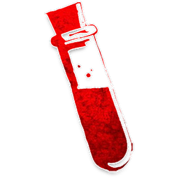

#  학살자 (Slayer)

**진영**:  마을 주민 (선 팀)

---

## 능력

게임당 **1회**, 낮에 1명을 선택. 대상이 **데몬이면 즉시 사망**.

---

## 플레이 가이드

### 당신이 해야 할 일

- **데몬 찾기**: 확실한 데몬 후보를 찾으세요.
- **신중한 사용**: 한 번만 쓸 수 있으므로 확신이 있을 때 사용하세요.
- **타이밍**: 늦게 쓸수록 정보가 많지만, 너무 늦으면 기회를 놓칩니다.

### 사용 규칙

- **낮에만**: 낮 토론 중에 공개적으로 선언합니다.
- **1회 제한**: 성공 여부와 무관하게 **한 번만** 사용 가능합니다.
- **즉시 사망**: 데몬이 맞으면 **그 자리에서 즉시 죽습니다** (선 팀 승리).
- **실패 시**: 데몬이 아니면 아무 일도 안 일어납니다.

### 주의할 점

-  **취함**: 당신이 취한 상태면 능력이 **발동 안 됩니다**.
-  **중독**: 중독되면 능력이 **발동 안 됩니다**.
-  **은둔자**: 데몬으로 등록되어도 **죽지 않습니다** (진짜 데몬만 죽음).
- **공개 능력**: 사용하면 모두가 알게 되므로 블러프가 어렵습니다.

### 전략 팁

1. **정보 수집**:  점술사,  공감자 정보를 모으세요.
2. **확신 필요**: 70% 이상 확신이 들 때 사용하세요.
3. **늦은 게임**: 3-4일차에 사용하면 정보가 많아 성공률이 높습니다.
4. **블러프 대비**: 악 팀도 학살자를 사칭할 수 있습니다.
5. **실패 후**: 실패했다면 그 사람은 데몬이 아니라는 정보가 됩니다.

---

## 상호작용

-  **임프**: 성공하면 즉시 죽이고 선 팀 승리.
-  **붉은 여인**: 생존자 5명 이상이면 승계될 수 있으니 주의.
-  **은둔자**: 데몬으로 등록되어도 능력은 발동 안 됨.

---

→ [마을 주민 목록](townsfolk.md) | [역할 분류](roles.md) | [규칙 메인](index.md)
