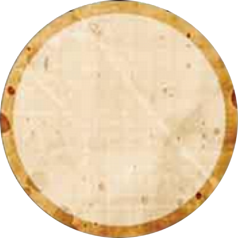

# 주요 상태

플레이어는 게임 중 다양한 상태를 가질 수 있습니다.

---

##  생존 (Alive)

- [지목](day.md)·[투표](day.md) 모두 가능합니다.
- 역할 능력을 정상적으로 사용합니다.
- 처형 문턱값 계산에 포함됩니다.

---

##  사망 (Dead)

### 사망 원인
- **처형**: 낮 투표로 처형당함 (처형과 사망은 다른 개념입니다)
- **밤 공격**: 임프 등의 밤 능력으로 사망
- **특수 능력**: 학살자 선언, 처녀 능력 등

### 사망자 규칙

| 항목 | 가능 여부 |
|---|---|
| **발언** | **가능** — 토론에 자유롭게 참여 |
| **투표** | **유령표 1회** 사용 가능 → 이후 투표 불가 |
| **지목** | **불가** — 죽은 플레이어는 지목할 수 없음 |
| **역할 능력** | **비활성화** — 사망 즉시 능력 상실 |
| **밤 행동** | **없음** — 눈을 감고 대기 |
| **재사망** | **불가** — 이미 죽은 플레이어에게 추가 공격은 효과 없음 |

> ⚠️ 사망한 플레이어도 **처형 대상이 될 수 있습니다** (하루 1회 처형 규칙에 포함).

### "사망 시" 능력 예외
-  **까마귀 사육사**: 사망하는 그 밤에 능력이 발동합니다.
- 이러한 능력은 사망 "시점"에 작동하며, 이후에는 비활성화됩니다.

---

##  중독 (Poisoned)

 [독살자](minion.md)가 매 밤 1명을 중독시킵니다.

### 중독 효과

- 중독된 플레이어의 **능력이 없는 것과 동일**하게 취급됩니다.
- 받는 정보가 **틀릴 수 있습니다** (이야기꾼이 거짓 정보를 줄 수 있음).
- **본인은 중독 여부를 알 수 없습니다** — 이야기꾼은 절대 중독 사실을 알려주지 않습니다.
- 선택형 능력 (수도사 보호 등)도 **효과가 없습니다**.
- "1회 사용" 능력을 중독 상태에서 사용하면 **영구적으로 소진**됩니다 (회복 후 재사용 불가).

### 중독 지속

- 독살자가 선택한 **그 밤과 다음 낮** 동안 지속됩니다.
- 다음 밤에 독살자가 **다른 대상**을 선택하면 자동 해제됩니다.
- 독살자가 같은 대상을 재선택하면 중독이 연장됩니다.

### 중독과 능력 상호작용

- 중독된 플레이어에게 **다른 능력을 사용하는 것은 정상 작동**합니다.
  - 예: 중독된 플레이어를 임프가 공격하면 정상적으로 사망합니다.
- 중독된 플레이어가 **능력을 사용하는 것은 효과 없음**.
  - 예: 중독된 수도사가 보호를 선택해도 보호 효과 없음.

---

##  취함 (Drunk)

[주정뱅이](outsider.md) 역할에 부여된 **영구 상태**입니다.

### 취함 효과

- 본인은 자신이 **다른 마을 주민**이라고 믿지만, 실제로는 아웃사이더(주정뱅이)입니다.
- 능력이 **항상 오작동**합니다 — 매 밤 거짓 정보를 받을 수 있습니다.
- 이야기꾼은 정상적으로 깨워서 행동시키지만, 결과는 이야기꾼 재량으로 결정됩니다.
- 중독과 달리 **게임 내내 해제되지 않습니다**.

### 셋업 규칙

- 이야기꾼이 셋업 시 마을 주민 토큰 1개를 **주정뱅이로 지정**합니다.
- 해당 플레이어는 자신이 그 마을 주민이라고 믿고 플레이합니다.
- 예: 주정뱅이가 "공감인"으로 지정되면, 본인은 공감인이라고 믿지만 실제 능력은 작동하지 않습니다.

---

## 중독 vs 취함 비교

| 구분 |  중독 |  취함 |
|------|------|------|
| **원인** | 독살자가 매 밤 선택 | 주정뱅이 역할 자체 |
| **지속** | 1밤 + 다음 낮 (재선택 시 연장) | **영구** (게임 전체) |
| **본인 인지** | 모름 | 모름 (다른 역할이라고 믿음) |
| **효과** | 능력 오작동 + 거짓 정보 | 능력 오작동 + 거짓 정보 |
| **해제** | 독살자가 다른 대상 선택 시 | 해제 불가 |
| **중첩** | 취함 + 중독 = 둘 다 적용 (상쇄 안 됨) | - |

> ⚠️ **중독과 취함은 서로 상쇄되지 않습니다.** 주정뱅이가 독살자에게 중독되면 두 상태가 동시에 적용됩니다.

두 상태 모두 본인이 알 수 없으므로, **선 팀 정보의 신뢰성을 항상 의심**해야 합니다.

---

## 건강 / 맑은 정신 (Healthy / Sober)

- **건강(Healthy)**: 중독되지 않은 상태. 능력이 정상 작동합니다.
- **맑은 정신(Sober)**: 취하지 않은 상태. 능력이 정상 작동합니다.
- 대부분의 플레이어는 게임 내내 건강하고 맑은 정신 상태입니다.

---

## 진영 (Alignment)

- **선(Good)** 또는 **악(Evil)** 중 하나입니다.
- 진영은 게임 중 **변경될 수 있습니다** (예: 임프 자결 → 미니언 승계).
- 진영이 변경되면 가장 이른 기회에 **비밀리에** 알려줍니다.
- 진영은 역할(Character)과 **독립적**입니다.

---

→ [밤 진행](night.md) | [미니언](minion.md) | [처음으로](index.md)
