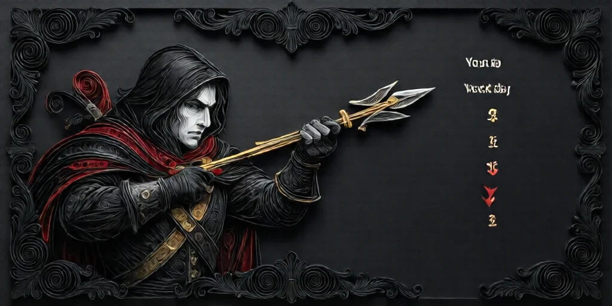
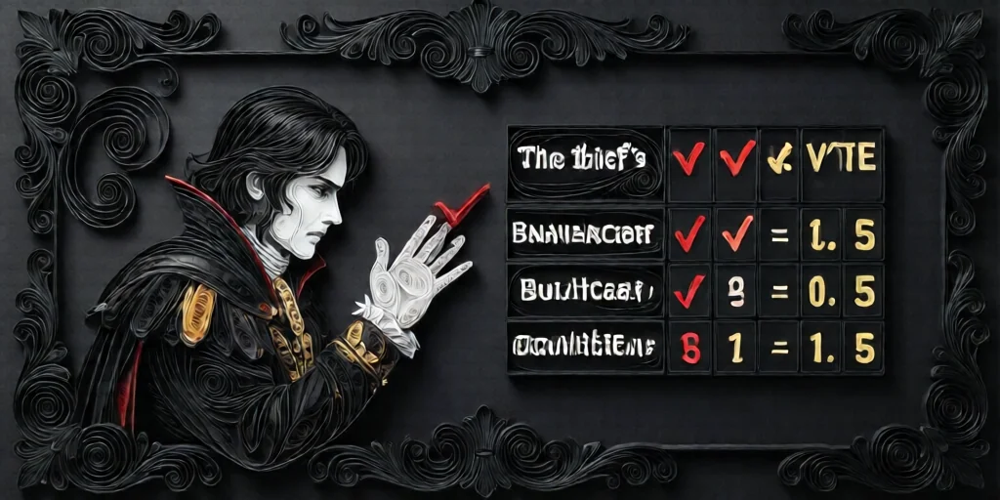

#  도둑 (Thief)

**분류**:  여행자 (Traveller)

---

## 능력

매일 [밤](night.md) 자신이 아닌 플레이어 1명을 선택합니다. 다음 날 그 플레이어의 [투표](day.md)는 **-1표**로 계산됩니다.

---

## 작동 방식

-  도둑은 매일 밤 1명을 지정합니다.
- 그 플레이어가 다음 날 손을 들면, 표 수가 **올라가는 대신 1 내려갑니다**.
- 대상 플레이어가 여러 번 투표하면, 그날 모든 처형 투표에서 계속 -1표로 적용됩니다.
-  도둑이 죽거나 추방되면 음수 표 효과는 즉시 사라집니다.

### 중요 포인트

-  이야기꾼이 공개 집계하는 과정에서 누가 -1표 대상인지 드러납니다.
-  추방은 능력 영향을 받지 않으므로, [추방 지지](day.md)에는 -1표가 적용되지 않습니다.
-  잘못된 타이밍에 손들면 오히려 처형 수치를 떨어뜨려 팀에 큰 손해를 줄 수 있습니다.

---

## 활용

-  선 도둑은 의심 강한 플레이어의 표를 약화시켜 위험한 처형을 막을 수 있습니다.
-  악 도둑은 선 팀이 만든 처형 흐름을 무너뜨리기 좋습니다.
-  표 집계가 공개로 흔들리기 때문에, 정보 교란과 압박 효과가 동시에 큽니다.

---

## 상호작용

-  **[추방](day.md)**: 추방 지지에는 영향을 주지 않습니다.
-  **[장의사](undertaker.md)**: 도둑 능력은 처형 대상을 바꿀 수 있지만, 스스로 죽이지는 않습니다.
-  **사망/추방**: 도둑이 능력을 잃는 즉시 음수 표도 사라집니다.

---

→ [희생양](scapegoat.md) | [총잡이](gunslinger.md) | [거지](beggar.md) | [관료](bureaucrat.md)
→ [여행자 규칙](travellers.md) | [낮 진행](day.md) | [밤 진행](night.md) | [장의사](undertaker.md) | [규칙 메인](index.md)

