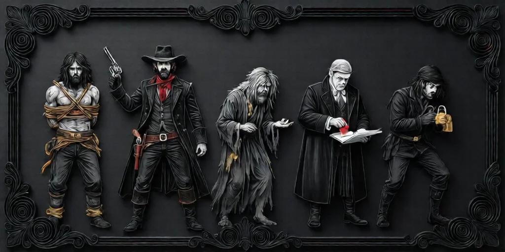

#  여행자 (Travellers)

늦게 합류하거나 중간에 먼저 나가야 하는 플레이어를 위한 특수 역할입니다.
정체와 능력은 **공개**되지만, 진영은 이야기꾼이 정하며 **공개되지 않습니다**.

---

## 핵심 규칙

-  **아무 때나 합류 가능**: 여행자는 게임 도중 언제든 들어올 수 있습니다.
-  **아무 때나 이탈 가능**: 먼저 나가야 하는 플레이어를 자연스럽게 수용합니다.
-  **능력은 매우 강함**: 일반 역할보다 영향력이 크지만, 정보는 적습니다.
-  **악 여행자 정보**: 악이라면 [악마](demon.md)가 누구인지 **만** 알며, 다른 악 팀 정보나 블러프 3개는 받지 않습니다.

---

## 일반 플레이어와 다른 점

### 공개 정보

-  어떤 여행자인지는 모두가 압니다.
-  어떤 능력을 갖는지도 모두가 압니다.
-  하지만 그 여행자가 **선인지 악인지**는 공개되지 않습니다.

### 추방 (Exile)

-  여행자는 [처형](day.md) 대신 **추방**될 수 있습니다.
-  추방은 그날의 [처형](day.md) 1회를 소모하지 않습니다.
-  하루에 추방은 **여러 번** 일어날 수 있습니다.
-  **모든 플레이어가 추방에 찬성할 수 있습니다**. 죽은 플레이어도, 유령표가 없어도 가능합니다.
-  **능력은 추방 결정에 영향을 줄 수 없습니다**. 추방은 [투표](day.md)처럼 보여도 별도의 절차입니다.

### 승리 조건 계산

-  여행자는 **악 팀의 2인 생존 승리 계산에서 제외**됩니다.
-  즉, 여행자 1명과 일반 플레이어 2명만 살아 있어도 악 팀 승리 조건이 충족될 수 있습니다.

### 능력 상실

-  여행자가 죽거나 추방되면 즉시 능력을 잃습니다. → [주요 상태](statuses.md)
-  따라서 지속형 여행자 능력은 추방 즉시 끝날 수 있습니다.

---

## Trouble Brewing 여행자 5명

###  [희생양 (Scapegoat)](scapegoat.md)
같은 진영 플레이어가 [처형](day.md)될 때, 자신이 대신 처형될 수 있습니다.

###  [총잡이 (Gunslinger)](gunslinger.md)
매일 첫 번째 [처형 투표](day.md)가 끝난 뒤, 방금 투표한 사람 1명을 죽일 수 있습니다.

###  [거지 (Beggar)](beggar.md)
[투표](day.md) 토큰이 있어야만 투표할 수 있으며, 죽은 플레이어에게 토큰을 받으면 그 플레이어의 진영을 알게 됩니다.

###  [관료 (Bureaucrat)](bureaucrat.md)
[밤](night.md)마다 1명을 골라, 다음 날 그 사람의 표를 3표로 만듭니다.

###  [도둑 (Thief)](thief.md)
[밤](night.md)마다 1명을 골라, 다음 날 그 사람의 표를 -1표로 만듭니다.

---

## 운영 메모

-  여행자는 기본 Trouble Brewing 입문 게임에는 보통 넣지 않습니다.
-  15명 초과 게임이나 지각/조퇴 플레이어가 있을 때 특히 유용합니다.
-  능력이 강력하므로, 이야기꾼은 진영 배정과 추방 분위기를 신중하게 관리해야 합니다.

---

→ [희생양](scapegoat.md) | [총잡이](gunslinger.md) | [거지](beggar.md) | [관료](bureaucrat.md) | [도둑](thief.md)
→ [낮 진행](day.md) | [밤 진행](night.md) | [주요 상태](statuses.md) | [역할 분류](roles.md) | [규칙 메인](index.md)
